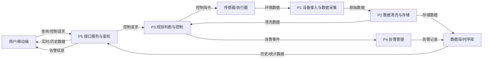

# DFD Level 1（系统分解）

```mermaid
flowchart LR
  %% 外部实体
  U["用户/移动端"]
  D["传感器/执行器"]
  DB["数据库/时序库"]

  %% 处理过程
  P1["P1 设备接入与数据采集"]
  P2["P2 数据清洗与存储"]
  P3["P3 规则判断与控制"]
  P4["P4 告警管理"]
  P5["P5 接口服务与鉴权"]

  %% 数据流
  D -->|环境数据| P1
  P1 -->|原始数据| P2
  P2 -->|存储数据| DB
  DB -->|历史/统计数据| P5
  P2 -->|清洗数据| P3
  P3 -->|控制指令| D
  P3 -->|告警事件| P4
  P4 -->|告警记录| DB
  U -->|查询/控制请求| P5
  P5 -->|实时/历史数据| U
  P5 -->|控制请求| P3
  P5 -->|告警信息| U
```
