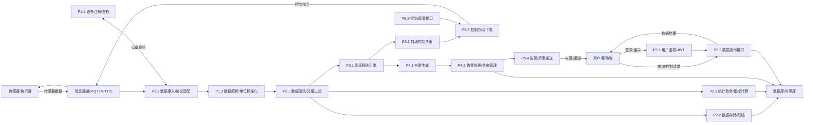

# DFD Level 2（模块化细分）

```mermaid
flowchart LR
  %% 外部实体
  U["用户/移动端"]
  D["传感器/执行器"]
  MQ["消息通道(MQTT/HTTP)"]
  DB["数据库/时序库"]

  %% 设备接入与数据采集
  P1A["P1.1 设备注册/鉴权"]
  P1B["P1.2 数据接入/协议适配"]
  P1C["P1.3 数据解析/单位标准化"]

  %% 数据处理与存储
  P2A["P2.1 数据清洗/异常过滤"]
  P2B["P2.2 数据存储/归档"]
  P2C["P2.3 统计聚合/指标计算"]

  %% 规则与控制
  P3A["P3.1 阈值规则引擎"]
  P3B["P3.2 自动控制决策"]
  P3C["P3.3 控制指令下发"]

  %% 告警
  P4A["P4.1 告警生成"]
  P4B["P4.2 告警处理/状态管理"]

  %% 接口与权限
  P5A["P5.1 用户鉴权/JWT"]
  P5B["P5.2 数据查询接口"]
  P5C["P5.3 控制/配置接口"]
  P5D["P5.4 告警/消息推送"]

  %% 数据流
  D -->|传感器数据| MQ --> P1B
  P1A <-->|设备身份| P1B
  P1B --> P1C --> P2A --> P2B --> DB
  P2A --> P2C --> DB

  P2A --> P3A --> P3B --> P3C -->|控制指令| MQ --> D

  P3A --> P4A --> P4B --> DB

  U -->|登录/鉴权| P5A
  U -->|查询/控制请求| P5B
  P5A --> P5B --> DB
  P5B -->|数据结果| U
  P5C --> P3C
  P4B --> P5D -->|告警/通知| U
```
