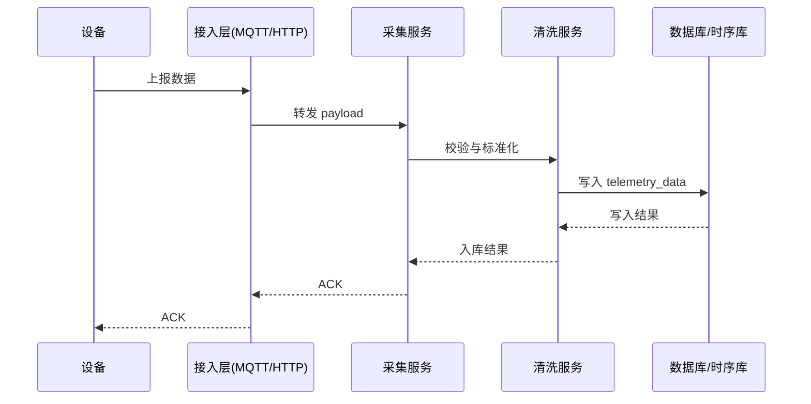
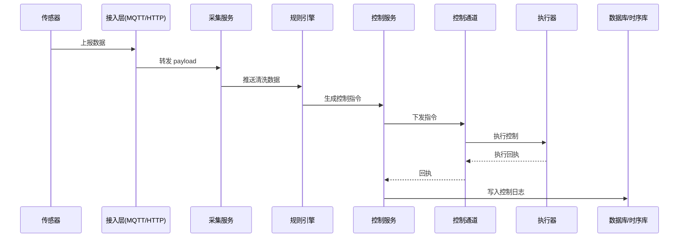
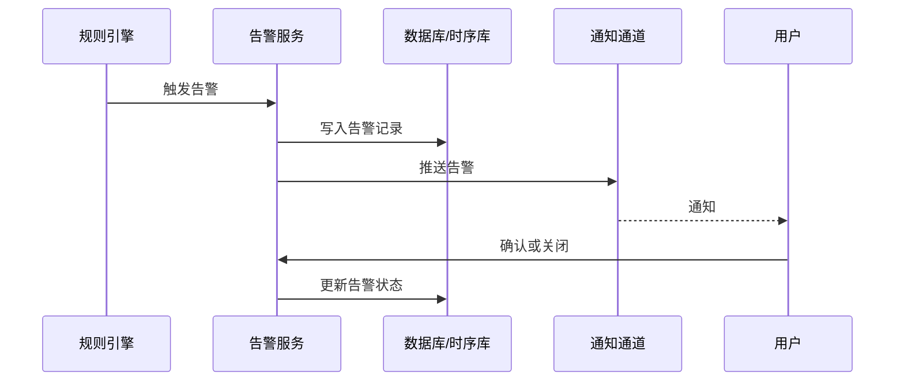

# 关键流程时序图

## 1. 数据上报 → 存储

```mermaid
sequenceDiagram
  participant D as 设备
  participant GW as 接入层(MQTT/HTTP)
  participant ING as 采集服务
  participant CLEAN as 清洗服务
  participant DB as 数据库/时序库

  D->>GW: 上报数据
  GW->>ING: 转发 payload
  ING->>CLEAN: 校验与标准化
  CLEAN->>DB: 写入 telemetry_data
  DB-->>CLEAN: 写入结果
  CLEAN-->>ING: 入库结果
  ING-->>GW: ACK
  GW-->>D: ACK
```

## 2. 阈值触发 → 自动控制

```mermaid
sequenceDiagram
  participant D as 传感器
  participant GW as 接入层(MQTT/HTTP)
  participant ING as 采集服务
  participant RULE as 规则引擎
  participant CTRL as 控制服务
  participant MQ as 控制通道
  participant ACT as 执行器
  participant DB as 数据库/时序库

  D->>GW: 上报数据
  GW->>ING: 转发 payload
  ING->>RULE: 推送清洗数据
  RULE->>CTRL: 生成控制指令
  CTRL->>MQ: 下发指令
  MQ->>ACT: 执行控制
  ACT-->>MQ: 执行回执
  MQ-->>CTRL: 回执
  CTRL->>DB: 写入控制日志
```

## 3. 告警闭环

```mermaid
sequenceDiagram
  participant RULE as 规则引擎
  participant ALERT as 告警服务
  participant DB as 数据库/时序库
  participant NOTI as 通知通道
  participant U as 用户

  RULE->>ALERT: 触发告警
  ALERT->>DB: 写入告警记录
  ALERT->>NOTI: 推送告警
  NOTI-->>U: 通知
  U->>ALERT: 确认或关闭
  ALERT->>DB: 更新告警状态
```
